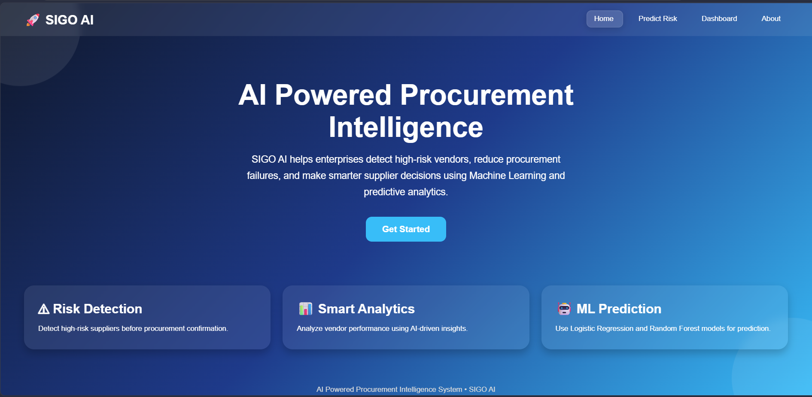
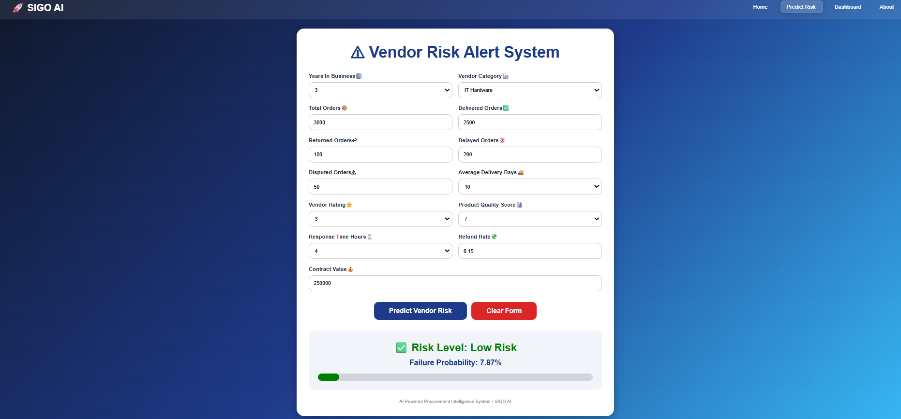
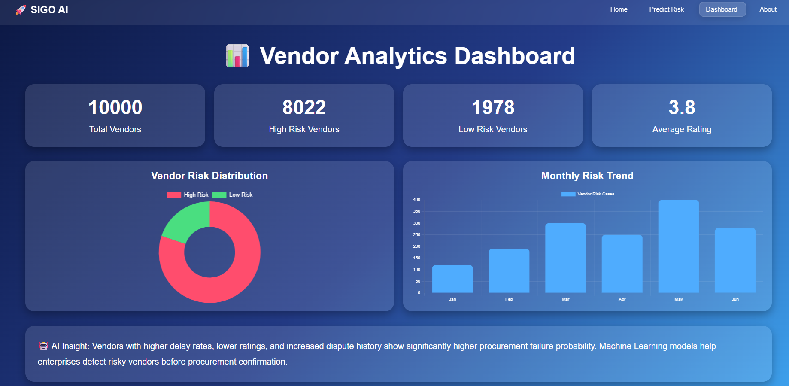

# 🚀 Sigo AI — Vendor Risk Prediction

AI-powered vendor risk prediction and procurement intelligence system built using Machine Learning and Flask.

Sigo AI helps organizations identify high-risk vendors and make data-driven procurement decisions using vendor performance and operational metrics.

## 📌 Features

- 🔍 Vendor risk prediction
- 🤖 Machine Learning-based risk classification
- 📊 Vendor analytics dashboard
- 📈 Risk distribution and trend visualization
- 🧠 Failure probability estimation
- 🏢 Vendor category analysis
- 🌐 Flask-based web application

## 🧠 Machine Learning

The system uses two trained Machine Learning models:

- **Logistic Regression** — used to estimate vendor failure probability
- **Random Forest** — used for vendor risk classification

The application processes vendor information such as:

- Years in business
- Total, delivered, returned and delayed orders
- Disputed orders
- Average delivery time
- Vendor rating
- Product quality score
- Response time
- Refund rate
- Contract value
- Vendor category

Additional calculated features include delivery delay rate, return rate and dispute rate.

## 🛠️ Tech Stack

- **Python**
- **Flask**
- **Pandas**
- **Scikit-learn**
- **Joblib**
- **HTML/CSS**

## 📸 Screenshots

### 🏠 Home



### 🔮 Vendor Risk Prediction



### 📊 Analytics Dashboard



## ⚙️ Installation

### 1. Clone the repository

```bash
git clone https://github.com/sushmaa-r/Vendor-Risk-Prediction-Sigo-AI.git
cd Vendor-Risk-Prediction-Sigo-AI
